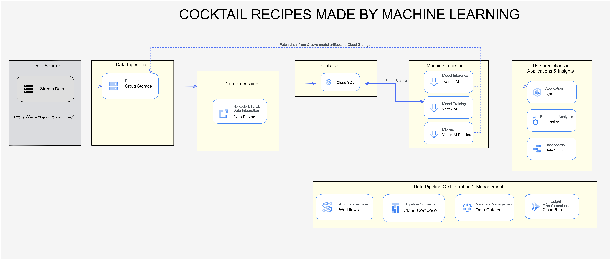

# Data Product Architecture Team 1: Bookish Journey

| Name                           | Email                  | CU     | Github Handler |
|:------------------------------:|:----------------------:|:------:|:--------------:|
| Adrian Tame                    | atamejac@itam.mx       | 142235 | AdrianTJ       |
| Joel Jaramillo Pacheco         | joel.jaramillo@itam.mx | 30615  | joelitam2021   |
| Mónica Altagracia García López | mgarc372@itam.mx       | 203145 | mogarcia62     |
| Juan Carlos Soto Hernández     | jsotoher@itam.mx       | 82616  | JSOHE          |

Why we are an awesome team: Our professional profiles make a great match because they are very varied, and we are very open to collaborating between ourselves and with others to reach the objectives of the course. 

# COCKTAIL RECOMMENDATION SYSTEM :cocktail: :tropical_drink: :wine_glass:

# 1-2. Objetive and Users

Are you tired of always drinking the same drinks and cocktails? Would you like to drink something new but do not have time to ask your family or friends? Our product could spice things up at your next gathering!

**The goal of this repository is to build a simple recommendation system based on drink and cocktail recipes from around the world**. We will see how we can collect data, implement a machine learning model that analyzes recipes to make the drinks or even use it to create our own new recipes, and we will design a basic interface so that anyone can consult it and even bars or restaurants that wish to expand their bar of drinks and cocktails.

The business problem is a simple one: you might be a bartender and you get asked to recommend a drink, or you want to build a menu that is consistent to peoples tastes, or has a theme. Or maybe, you want to see drinks similar to the ones that can be made with the ingredients you have on hand or the ones you like to buy. The end user is someone familiar with drinks, and one that wants to implement a way for themselves or people they know to try and experiment with cool, new drinks. 

While there are many ways to solve this problem, we believe that a Machine Learning solution is a right bet for this type of problem. Recommendation systems are one of [the central areas of research in machine learning](https://reader.elsevier.com/reader/sd/pii/S1110866515000341?token=F77D4BE37B9D418490451E22B2E4AD82F3FB974AD6DDDBAE5477120DC82498DF4351B3EAB515ECE1D3D10636CF31451C&originRegion=us-east-1&originCreation=20220322175629), and as such, there is vast literature and area knowledge we can expand on and use to build some interesting things. [There have even been projects similar to ours](https://d1wqtxts1xzle7.cloudfront.net/34448716/Food_recommendation_system_using_food_clustering_analysis_for_diabetic_patients-with-cover-page-v2.pdf?Expires=1647975512&Signature=eEkUdxA0gxi-6UKprv3DLNap1AFtPzJfORTmxk5p5~3CAOdY9K07xOAfEhtBylovpoxGcfwMZsvCgdJM2kAtAJBGBLf6-Jjq8gaiI90fqsQNT0LJSKc9ssCB84-2SGbnM2zKN8Ea81~MOYpqu5cWMVP9FjgI6lZSatxNek~ru9ZmvQRu9RfaND-vfJkzi89ToRO9~aUyqOqWaV2syryEQigrurF05B7fTjFv5EwJsDUNcK0LtJ0MH-TNcVIs1Sj6C5~WhJhNijTuk6VGtyOCd1nUAwo1vmf5iKLHzi-cB2~qy3EqvKGpy69ma9azQ9anJBEe6a7l0x7mNt-q3JM8TA__&Key-Pair-Id=APKAJLOHF5GGSLRBV4ZA), but with an emphasys on food instead of drinks. 

While the central aim of this project is to create a recommendation system for drinks that already exist, *i.e.* you input a drink and get similar ones, there is also the possibility of us examnding it to get recommendations based of a list of ingredientes, rather than a drink that already exists as input. 

In our opinion, this is a great way to explore drinks. A simple interface with a back end that isn't bbased on ML models could give recommendations that re repetitive, and would need to be updated by hand whenever a new drink is added to the database. We already have a model trained, and all we would need to do is generate predictions or recommendations for new observations. Not only that, but it is practically scalable to a much greater size should more drinks be added to the database. 

Getting into specifics a little more, this problem would be an unsupervised learning problem. After some research, we noted that [the state of the art seem to be hybrid recommendation systems](https://link.springer.com/content/pdf/10.1023/A:1021240730564.pdf). [This is backed up by a lot of literature on the matter](https://arxiv.org/pdf/1901.03888.pdf). As such, our goal would be to incorporate different algorithms to generate a group of recommendations that are varied and have many different models in the backend. 

# 3. Data Product Architecture Diagram

The following diagram provides an overview into the tech stack and general architecture of the entire data product we are creating, from calling the API to get data up to getting the recommendations themselves. This tech stack has many components, but below we list some of the most important ones and the reasons why we chose them. 



* **Data Lake:** Our cloud storage solution. Basically, we need somewhere to store our raw and clean data, as well as the model. A more sophisticated solution is not really necessary for the needs of this data product and stack, and as such, we keep it simple by dumping the files we need in a bucket. 

* **Vertex AI:** We are handling model training, tuning, and generation in Vertex AI. This is because we are very familiar with the interface of Jupytr notebooks and are comfortable using them to generate the needed models. 

* **CloudSQL:** Our initial data load is through a Jupytr notebook that extracts the information from the API, but, we manipulate and transform the data in SQL as a followup step to be able to use it in the notebooks that generate the models and give us sume visualization tools. 

**Note:** While this diagram is not final, it is the initial idea we came up with, and will be edited or changed depending on the needs and problems we encounter when building the finalized product. 

# 4. Dataset

For the porpuse, the data pulled from **TheCocktailDB** (https://www.thecocktaildb.com/), an open crowd-sourced database of drinks and cocktails from around the world.
The dataset contains 635 international drinks and cocktails recipes, 488 ingredients, and 635 drink images, one for each cocktail. 

The way we interact with the database is through API calls. The developers state on their site that the developer key "1" is provided for anyone using the database with educational or research purposes, so that is the one we are using. When we ping the server with a GET request, the response is a JSON with the relevant information asked for. As an example, the request `www.thecocktaildb.com/api/json/v1/1/lookup.php?i=11007`, which is a lookup of a specific cocktail, returns: 

```json
{"drinks":[{"idDrink":"11007","strDrink":"Margarita","strDrinkAlternate":null,"strTags":"IBA,ContemporaryClassic","strVideo":null,"strCategory":"Ordinary Drink","strIBA":"Contemporary Classics","strAlcoholic":"Alcoholic","strGlass":"Cocktail glass","strInstructions":"Rub the rim of the glass with the lime slice to make the salt stick to it. Take care to moisten only the outer rim and sprinkle the salt on it. The salt should present to the lips of the imbiber and never mix into the cocktail. Shake the other ingredients with ice, then carefully pour into the glass.","strInstructionsES":null,"strInstructionsDE":"Reiben Sie den Rand des Glases mit der Limettenscheibe, damit das Salz daran haftet. Achten Sie darauf, dass nur der \u00e4u\u00dfere Rand angefeuchtet wird und streuen Sie das Salz darauf. Das Salz sollte sich auf den Lippen des Genie\u00dfers befinden und niemals in den Cocktail einmischen. Die anderen Zutaten mit Eis sch\u00fctteln und vorsichtig in das Glas geben.","strInstructionsFR":null,"strInstructionsIT":"Strofina il bordo del bicchiere con la fetta di lime per far aderire il sale.\r\nAvere cura di inumidire solo il bordo esterno e cospargere di sale.\r\nIl sale dovrebbe presentarsi alle labbra del bevitore e non mescolarsi mai al cocktail.\r\nShakerare gli altri ingredienti con ghiaccio, quindi versarli delicatamente nel bicchiere.","strInstructionsZH-HANS":null,"strInstructionsZH-HANT":null,"strDrinkThumb":"https:\/\/www.thecocktaildb.com\/images\/media\/drink\/5noda61589575158.jpg","strIngredient1":"Tequila","strIngredient2":"Triple sec","strIngredient3":"Lime juice","strIngredient4":"Salt","strIngredient5":null,"strIngredient6":null,"strIngredient7":null,"strIngredient8":null,"strIngredient9":null,"strIngredient10":null,"strIngredient11":null,"strIngredient12":null,"strIngredient13":null,"strIngredient14":null,"strIngredient15":null,"strMeasure1":"1 1\/2 oz ","strMeasure2":"1\/2 oz ","strMeasure3":"1 oz ","strMeasure4":null,"strMeasure5":null,"strMeasure6":null,"strMeasure7":null,"strMeasure8":null,"strMeasure9":null,"strMeasure10":null,"strMeasure11":null,"strMeasure12":null,"strMeasure13":null,"strMeasure14":null,"strMeasure15":null,"strImageSource":"https:\/\/commons.wikimedia.org\/wiki\/File:Klassiche_Margarita.jpg","strImageAttribution":"Cocktailmarler","strCreativeCommonsConfirmed":"Yes","dateModified":"2015-08-18 14:42:59"}]}
```

To be able to get all the information from the database, we had to get a little creative. We could have looked up each drink bby ID, but this would have been too many get requests for the server and could cause problems. What we decided to do was use the lookup by letter, to return all cocktails that start with a certain letter, and then paste those JSONs together to get the entire database. Only after doing this do we store the data in our cloud storage, and we save a JSON per drink, in a folder with its ID as the name. That is the initial data transform to load the information, but afterwords, we clean the data in SQL and only keep the ingredients for each cocktail, which is what we use to generate the models. 

# 5. Modeling

1. **What types of models/architectures will you be using for this application? Which ones would you start with?**
   
   Because the model we want to build is a hybrid model, there are various parts or components that we would like to leverage to be able to get recommendations. Something important to note is that each one of these components is in itself a recommendation system, but by making a selection or intersection of different systems, we believe we can get more varied and better results. We are starting with somethig that is not a ML model at all, [cosine similarity](https://en.wikipedia.org/wiki/Cosine_similarity). This is in our opinion the easiest to implement, and can give us a good idea of some basic recommendations. 
   
   After that, we want to build a more robust ML system that will be based on clustering. We want to start with [k-means clustering](https://en.wikipedia.org/wiki/K-means_clustering), and grow to other clustering algorithms from there. This is where the meat of the machine learning computation will take place. Something interesting to note is that we have discrete classes and k-means clustering works **only on real vectors**, so we have to solve the problem of generating real vectors from a list of categorical variables. This will be done by using [principal component analysis (PCA)](https://en.wikipedia.org/wiki/Principal_component_analysis) as an in-between step from having the raw ingredients to generating an n-dimensional aproximation to a point from that list. 
   
   The last cog in the machine learning puzzle is [market basket analysis](https://www.analyticsvidhya.com/blog/2021/10/a-comprehensive-guide-on-market-basket-analysis/). We want to leverage the predictive power that comes from this sort of algorithm to also make recommendations. We will try to implement this idea from [Mikael Davidsson](https://towardsdatascience.com/using-machine-learning-to-generate-recipes-that-actually-works-b2331c85ab72#d595) who tried to use machine learning to generate recipes that actually work, but we will apply it to cocktails. 
   
   Both of the ML solutions that we use to build our model are unsupervised, and as such, metrics are a little more complicated than simply evaluating mean squared error, but that discussion is saved for the next section. What we decided to do is select some recommendations from the output of each of these sub-models, and return a final drink list based on the outputs of the three components. 

# 6. Evaluation

One of the goals will be to generate high [Serendipity](https://eugeneyan.com/writing/serendipity-and-accuracy-in-recommender-systems/). Serendipity is a metric that is commonly used in recommender systems, where a high score means that the user was pleasantly surprised. 

1. **How would you evaluate your model performance, both during training and inference?**
   
   We have decided that we are doing model evaluation for each of our two ML models, and then after combining these with the cosine distance and generating our final meta-model, we are also doing some more subjective evaluation based not on metrics but on human input. 
   
   For the ML model evaluation, we really have two different models. For clustering, we are sticking to [silhouette curves](https://towardsdatascience.com/silhouette-method-better-than-elbow-method-to-find-optimal-clusters-378d62ff6891#:~:text=The%20silhouette%20value%20is%20a,poorly%20matched%20to%20neighboring%20clusters.) and [the elbow method](https://en.wikipedia.org/wiki/Elbow_method_(clustering)). We note that both of these metrics are heuristic, which makes sense because we are working with an unsupervised learning problem. While there are other metrics to evaluate the efficiency and predictive power of the clusters we define, we are sticking with these two because we have worked with them in the past and we have a good understanding of how to interpret them. 
   
   As for market basket analysis, there is the trifects of metrics that seems to be the go-to evaluation method: [support, confidence and lift](https://www.linkedin.com/pulse/market-basket-analysis-why-lift-odd-metric-nadamuni-ramesh/), with lift being the primary metric we are interested in. 
   
   The problem that we have is that the final model is a combination of models, and as such, there are not any pre-defined metrics that we know and are comftrable working with to understand the goodness of fit. As such, we want to rely on asking people's opinion on the matter, as at the end of the day, people are the final node of this data product, and their opinion on if them model is good or bad is the real test to see if it's working. 


2. **How would you evaluate whether your application satisfies its objectives?**
   
   The best way we can is to ask people to try cocktails recommended based on drinks they like, or simply ask if the recommendation makes sense. While this is as heuristic as metrics get, we hope that it at least gives us viable results. We also can know if the model is performing well based on the metrics and evaluation scores of the underlying smaller models that make up the final one. 

  

# 7. Inference

1. **Will you be doing online prediction or batch prediction or a combination of both?**
   
    Our solution will be to make online prediction, the user will provide some ingredients and the system will make a new cocktail.

2. **Will the inference be run on the device or through a server?**
   
    The inference will run through a server hosted on Google Cloud.

3. **Can you run inference on CPU or edge device or do you need GPU?**
   
    We assume that the model that we are going to develop to make the inference will not require a high level of processing, so it will be executed on  CPU.

# 8. Compute

1. **How much compute do you need to develop this application as a market-ready
   product?**
   
   Considering the size and scope of the data that we are working with and the fact that is is a relatively small dataset, we should be fine with working on CPU without needing to leverage more powerful compute resources. We will probably have two machines, one for storing the data and managing it in some SQL instance that could act as our [data warehouse](https://www.oracle.com/database/what-is-a-data-warehouse/#:~:text=A%20data%20warehouse%20is%20a,large%20amounts%20of%20historical%20data.), and another where we run the ML solutions that build our model, probably as an instance of [Vertex AI Workbench](https://cloud.google.com/vertex-ai/docs/workbench). 
   
   Our models will also be able to make predictions on CPU, which is important considering one of the final objectives that we wish to accomplish is being able to generate new drinks or recommendations of drinks based on certain ingredients, which requires being able to predict or extract new observations from our model. 

2. **How much compute do you need to develop this application for this project?**
   
   We do not expect too much compute to be needed to be able to generate a viable data product given the decisions we have made in terms of the models chosen and the database that we are working with. Something very important to consider though is that if this data product were at a larger scale, the clustering algorithms and recommendation system would have complex hyperparameters, and tuning these might require a much more intensive approach with heavier compute resources. For now though, we are sticking to relatively small machines. 

3. **Compute costs**
   
   Looking over [Vertex AI Pricing](https://cloud.google.com/vertex-ai/pricing#tabular-data) which we would use for model training and deployment and general [Compute Engine: Virtual Machines (VMs) Pricing](https://cloud.google.com/compute/all-pricing) on Google Cloud Platform, we note that even if we were using general purpose machines, such as the `e2-standard` family of VMs, we still would have ample resources for the tasks we need to perform. The smallest option, an `e2-highcpu-2`, has more than enough resources to perform good compute considering size of the database we have chosen. Price per hour is \$0.098 dollars per hour, which should not be a problem at all if we only turn it on at certain times when we are actively training the model. 

# 9. Minimum Viable Product (MVP)

1. **What would the MVP be?**
   
   Our minimum viable product consists of two different types of ML models coming together to make a new cocktail, which consists of generating a prediction of our integrated model. The ML models that we will be using to classify this data are both unsupervised models, namely clustering and market basket analysis. We hope that combining these two models will be able to generate interesting and complex preditions.
   
   At the end of the day though, what we want is a simple product: A user chooses from a list of ingredients a combination of them that they like, and based off of that list of ingredients, a cocktail in the databbase that matches them exactly is pulled, or, if that combination does not exist in the database, we use the information gathered by our models to create a brand new cocktail that matches those specifications exactly, and return cocktails in the database that are similar in ingredients but not exactly the same ones.

2. **How difficult is it to get there?**
   
   We expect to find difficulty in the recommendation system more than any other part of the data product. The generation of new observations based on unsupervised learning is a particularly finnicky task, especially considering that we do not have direct numeric metrics with which we can evaluate model performance. 
   
   We expect some difficulty along the way also with the creation of the VMs and the setting up of the work environment, because it is not something anyone on our team has done, but we are confident we can meet this challenge. 

# 10. Pre-mortems

1. **What are the risky aspects of the project?**
   
   One of the riskiest parts of this project is that we simply have very little data. That initially seemed like a blessing, considering that our model training would be esay and that we don't expect much difficulty in terms of setting up GPUs for more dedicated compute, but it could also be a curse. A problem we could face is that no matter how hard we try to generate new cocktails, some of them simply don't make sense because we don;t have varied enough observations and data to be able to properly predict new cocktails. This is worrying, but hopefully it won't become a problem in the future. [There are some very weird cocktails out there after all](https://www.forbes.com/sites/karlaalindahao/2020/11/12/16-unusual-cocktail-recipes-for-adventurous-drinkers/?sh=54c1ae0342b8), so maybe even if our predictions are strange, we can generate some interesting ones sometimes. 
   
   We also do not know how to implement the interface completely yet, but it is something we are hoping will become clear as we continue on with the course. 

2. **If your team fails to build the application you want, what do you think might have caused the failure?**
   
   Hopefully this is not something that happens, but we are somewhat concerned about the API. It is public, and there seems to be a developer key that simply is `1`, [as noted here](https://www.thecocktaildb.com/api.php). But, if access is restricted or problems arise in the database that we did not forsee, we are probably going to have a very bad time. One that is particularly scary and worrying is the database not using standard names for ingredients. As an example, if "Vodka" is a different ingredient from "Smirnoff Vodka", we are going to be in trouble considering the fact that our solution relies entirely on ingredients to generate cocktails and for the ML models to work. 
   
   We also might fil to build the particular prediction model if we deem the results that are returned to not be good enough, and we would have to leverage our models to be able to do something else with them in that case. 

3. **What are the limitations of your application?**
   
   The amount of data is a strong limitation and our knowledge of the platforms involved is also a relatively big limitation. We might be in a point where we want to expand or implement a core feature but are unable to do so because of our inexperience when it comes to cloud computing in general. 
   
   As for the product itself, one of the most important aspects of cocktail creation is preparation. As an example, a shaken martini is considered by some to have a different flavour profile than a mixed one because of the water content difference. This is not something we incorporate into our model at all, and that would be important in a real recipe. 

4. **What are the potential biases of your application?**
   
   The database is hoasted in the US and the entries are in english, which makes this us think that there is a particularly strong bias in the database for western cocktails or ones that are popular in the US. I very much doubt that the database has things such as a Michelada in them which are more regional drinks, let alone drinks that are primarily had in places where there is little contact with english in general. As such, the ingredients that we have and the final recommendations we make could be lacking because of a very particular geographical and lexical barrier in the database. 
