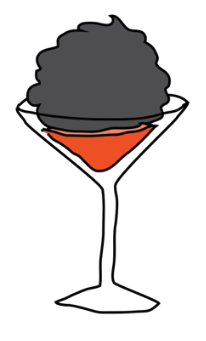
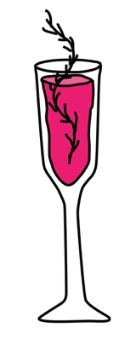

  

# Data Product Architecture Team 1: Bookish Journey

| Name                           | Email                   | CU     | Github Handler |
|:------------------------------:|:-----------------------:|:------:|:--------------:|
| Adrian Tame                    | atamejac@itam.mx        | 142235 | AdrianTJ       |
| Joel Jaramillo Pacheco         | joel.jaramillo@itam.mx  | 30615  | joelitam2021   |
| Mónica Altagracia García López | mgarc372@itam.mx        | 203145 | mogarcia62     |
| Juan Carlos Soto Hernández     | jsotoher@itam.com       | 82616  | JSOHE          |

Why we are an awesome team: Our professional profiles make a great match because they are very varied, and we are very open to collaborating between ourselves and with others to reach the objectives of the course. 

 # COCKTAIL RECIPES MADE BY MACHINE LEARNING :cocktail: 	:tropical_drink: :wine_glass:

Are you tired of always drinking the same drinks and cocktails? Would you like to drink something new but do not have time to ask your family or friends? A recommender system could give you some ideas!

**The goal of this repository is to build a simple recommendation system based on drink and cocktail recipes from around the world**. We will see how we can collect data, implement a machine learning model that analyzes recipes to make the drinks or even use it to create our own new recipes, and we will design a basic interface so that anyone can consult it and even bars or restaurants that wish to expand their bar of drinks and cocktails.

## Dataset

For the porpuse, the data pulled from **TheCocktailDB** (https://www.thecocktaildb.com/), an open crowd-sourced database of drinks and cocktails from around the world.
The dataset contains 635 international drinks and cocktails recipes, 488 ingredients, and 635 drink images.

# 5. Modeling

1. **What types of models/architectures will you be using for this application? Which ones would you start with?**

We want to start trying a basket analysis looking for combinations of ingredients that are mixed together. For this we will use association rules that are widely used to analyze retail basket or transaction data. Our objective will be to “predict the probability of ingredients that are being mixed together”  (Susan Li)[ https://towardsdatascience.com/a-gentle-introduction-on-market-basket-analysis-association-rules-fa4b986a40ce]

But then, we want to try with `TextGenRNN`,  wich is a text generation python lib that uses a Recurrent Neural Network (RNN). We will train this model on recipes, products or flavours.

RNN is one solution to the problem of working with sequential data, in this case we will try to give a set of ingredients and expect to get a nice drink.

Will try to implement this idea from [Mikael Davidsson] (https://towardsdatascience.com/using-machine-learning-to-generate-recipes-that-actually-works-b2331c85ab72#d595) who tried to use machine learning to generate recipes that actually work, but we will try to apply it to cocktails. 

Also one of the goals will be to generate high serendipity. Serendipity is a metric that is commonly used in recommender systems, where a high score means that the user was pleasantly surprised. We already have humans making cocktails, what we would like from an AI is a shockingly different but still tasty drink, free from human preconceived notions of what tastes good together.

# 6. Evaluation

1. **How would you evaluate your model performance, both during training and inference?**
Well in name of science our team will taste the drinks as long as it's not a weird drink. And rank 3 different categories.
Taste: 0/10
Ease of drinking: 0/10
Fun had: 0/10
Then we spec to define if is a good or bad cocktail.

2. **How would you evaluate whether your application satisfies its objectives?**

We hope more than half of our drinks and cocktails are viable because [Janelle Shane](https://www.aiweirdness.com/dont-let-a-neural-net-mix-drinks-18-12-14/)  said “Don`t  let a neural net mix drinks” 

Our objective is to generate new, drinkable an exciting new cocktail. But we are not sure all recipes are viable. We hope half our drinks are good.

{width=20%} {width=20%}

# 8. Compute

1. **How much compute do you need to develop this application as a market-ready
   product?**
   
   Considering the size and scope of the data that we are working with and the fact that is is a relatively small dataset, we should be fine with working on CPU without needing to leverage more powerful compute resources. We will probably have two machines, one for storing the data and managing it in some SQL instance that could act as our [data warehouse](https://www.oracle.com/database/what-is-a-data-warehouse/#:~:text=A%20data%20warehouse%20is%20a,large%20amounts%20of%20historical%20data.), and another where we run the ML solutions that build our model, probably as an instance of [Vertex AI Workbench](https://cloud.google.com/vertex-ai/docs/workbench). 
   
   Our models will also be able to make predictions on CPU, which is important considering one of the final objectives that we wish to accomplish is being able to generate new drinks or recommendations of drinks based on certain ingredients, which requires being able to predict or extract new observations from our model. 

2. **How much compute do you need to develop this application for this project?**
   
   We do not expect too much compute to be needed to be able to generate a viable data product given the decisions we have made in terms of the models chosen and the database that we are working with. Something very important to consider though is that if this data product were at a larger scale, the clustering algorithms and recommendation system would have complex hyperparameters, and tuning these might require a much more intensive approach with heavier compute resources. For now though, we are sticking to relatively small machines. 

3. **Compute costs**
   
   Looking over [Vertex AI Pricing](https://cloud.google.com/vertex-ai/pricing#tabular-data) which we would use for model training and deployment and general [Compute Engine: Virtual Machines (VMs) Pricing](https://cloud.google.com/compute/all-pricing) on Google Cloud Platform, we note that even if we were using general purpose machines, such as the `e2-standard` family of VMs, we still would have ample resources for the tasks we need to perform. The smallest option, an `e2-highcpu-2`, has more than enough resources to perform good compute considering size of the database we have chosen. Price per hour is \$0.098 dollars per hour, which should not be a problem at all if we only turn it on at certain times when we are actively training the model. 

# 9. Minimum Viable Product (MVP)

1. **What would the MVP be?**
   
   Our minimum viable product consists of two different types of ML models coming together to make a new cocktail, which consists of generating a prediction of our integrated model. The ML models that we will be using to classify this data are both unsupervised models, namely clustering and market basket analysis. We hope that combining these two models will be able to generate interesting and complex preditions.
   
   At the end of the day though, what we want is a simple product: A user chooses from a list of ingredients a combination of them that they like, and based off of that list of ingredients, a cocktail in the databbase that matches them exactly is pulled, or, if that combination does not exist in the database, we use the information gathered by our models to create a brand new cocktail that matches those specifications exactly, and return cocktails in the database that are similar in ingredients but not exactly the same ones.

2. **How difficult is it to get there?**
   
   We expect to find difficulty in the recommendation system more than any other part of the data product. The generation of new observations based on unsupervised learning is a particularly finnicky task, especially considering that we do not have direct numeric metrics with which we can evaluate model performance. 
   
   We expect some difficulty along the way also with the creation of the VMs and the setting up of the work environment, because it is not something anyone on our team has done, but we are confident we can meet this challenge. 

# 10. Pre-mortems

1. **What are the risky aspects of the project?**
   
   One of the riskiest parts of this project is that we simply have very little data. That initially seemed like a blessing, considering that our model training would be esay and that we don't expect much difficulty in terms of setting up GPUs for more dedicated compute, but it could also be a curse. A problem we could face is that no matter how hard we try to generate new cocktails, some of them simply don't make sense because we don;t have varied enough observations and data to be able to properly predict new cocktails. This is worrying, but hopefully it won't become a problem in the future. [There are some very weird cocktails out there after all](https://www.forbes.com/sites/karlaalindahao/2020/11/12/16-unusual-cocktail-recipes-for-adventurous-drinkers/?sh=54c1ae0342b8), so maybe even if our predictions are strange, we can generate some interesting ones sometimes. 
   
   We also do not know how to implement the interface completely yet, but it is something we are hoping will become clear as we continue on with the course. 

2. **If your team fails to build the application you want, what do you think might have caused the failure?**
   
   Hopefully this is not something that happens, but we are somewhat concerned about the API. It is public, and there seems to be a developer key that simply is `1`, [as noted here](https://www.thecocktaildb.com/api.php). But, if access is restricted or problems arise in the database that we did not forsee, we are probably going to have a very bad time. One that is particularly scary and worrying is the database not using standard names for ingredients. As an example, if "Vodka" is a different ingredient from "Smirnoff Vodka", we are going to be in trouble considering the fact that our solution relies entirely on ingredients to generate cocktails and for the ML models to work. 
   
   We also might fil to build the particular prediction model if we deem the results that are returned to not be good enough, and we would have to leverage our models to be able to do something else with them in that case. 

3. **What are the limitations of your application?**
   
   The amount of data is a strong limitation and our knowledge of the platforms involved is also a relatively big limitation. We might be in a point where we want to expand or implement a core feature but are unable to do so because of our inexperience when it comes to cloud computing in general. 
   
   As for the product itself, one of the most important aspects of cocktail creation is preparation. As an example, a shaken martini is considered by some to have a different flavour profile than a mixed one because of the water content difference. This is not something we incorporate into our model at all, and that would be important in a real recipe. 

4. **What are the potential biases of your application?**
   
   The database is hoasted in the US and the entries are in english, which makes this us think that there is a particularly strong bias in the database for western cocktails or ones that are popular in the US. I very much doubt that the database has things such as a Michelada in them which are more regional drinks, let alone drinks that are primarily had in places where there is little contact with english in general. As such, the ingredients that we have and the final recommendations we make could be lacking because of a very particular geographical and lexical barrier in the database. 
