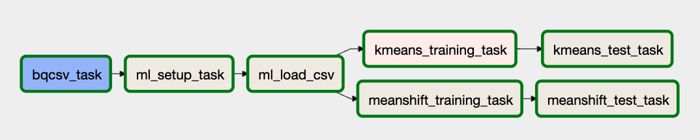

# Readme

This folder contains the following files **pertaining to the ETL** of our data:

- **dag.py** : This is the file that creates the DAG orchestration.
- **sql_elt_ddl.sql** : This file creates the SQL table where we grab the jsons we previously defined and transform them into a single table.
- **get_drinks.py**: This file contains the functions that we call to grab the data from the cocktails API and create the initial json files.

This folder contains the following files **pertaining to the ML training and results** of our data:

* `dag_ml.py`: The main DAG file for the orchestration of model retraining and results output. We also have an initial task in this DAG where we load the clean data from the ETL through a BigQuery Operator. It splits off into two different paths after some executions, which can be seen below in the next section.  

* `GCP_model_setup.sh`: Shell script that does a couple setup things so that modeling works. Initially, it calls another shell script, `GCP_variables.sh`, which includes all the relevant variables that we need to work with GCP. For obvious reasons, we do not upload this file. Then, it configures the project, setting it up with the correct project ID, and enables the APIs that we use to train and deploy the clustering models. Finally, the script creates a bucket where everything that we do in relation to clustering is stored. We note that since this bucket already exists, so most of the times this just returns an error, unless we delete it first.

* `ml_bigquery_csv.sql`: is the file that contains the code that the BigQuery operator uses to export the relevant table that we generated in the ETL steps to a csv, and stores it in the bucket where we keep all of our other files. 

* `kmeans_training.py`: One of the two main python scripts in this folder. This script first calls a YAML file called `GCP_model_details.yaml`, which we do not incluse because it contains sensitive project information. We then do the modeling and Feature Engineering for K-Means in particular, and train the model. Then use the `joblib` package to save the model to the bucket we created in the `GCP_model_setup.sh` shell script, in a folder called `KMeans`. We also save the folder locally for the next step in the orchestration. 

* `meanshift_training.py`: Refer to the write-up of the `kmeans_training.py` file, but replace all instances of KMeans with Meanshift. 

* `kmeans_test.py`: This file does some of the relevant training in PCA that we need for the clustering algorithms to work, and then we process that as the input to the clustering algorithms. From this file, we generate the results file `kmeans_results.csv` which contains the bach predictions from all the cocktails in the database. 

* `meanshift_test.py`: Refer to the write-up of the `kmeans_test.py` file, but replace all instances of KMeans with Meanshift.

## ML DAG  Orchestration

The `dag_ml` file is the file that defines the orchestration and training routine. This creates a DAG by the name of `drinks_ml_dag`. 

We note that the previous tasks pertain to running the following files: 

* **bq_csv_task** runs the file `ml_bigquery_csv.sql`
* **ml_setup_task** runs the file `GCP_model_setup.sh`
* **ml_load_csv** does not run a specific file, but a bash command that moves the clean data from a GCP bucket to the local folder in the airflow where it can be accessed by the subsequent python files that are run.
* **kmeans_training_task** runs the file `kmeans_training.py`
* **meanshift_training_task** runs the file `meanshift_training.py`
* **kmeans_test_task** runs the file `kmeans_test.py`
* **meanshift_test_task** runs the file `meanshift_training.py` 

## Where to find these files?

The files created by the Dags can be found in specified bucket in yaml file called by *cocktails.yaml*.

The tables created in bigquery by *sql_elt_ddl* can be found in bigquery space (*indredients_dag* and *cocktails_dag*).

The final predictions are stored in the respective folders of each model, for example, the KMeans result is stored in the bucket containing the clustering algorithms. 
