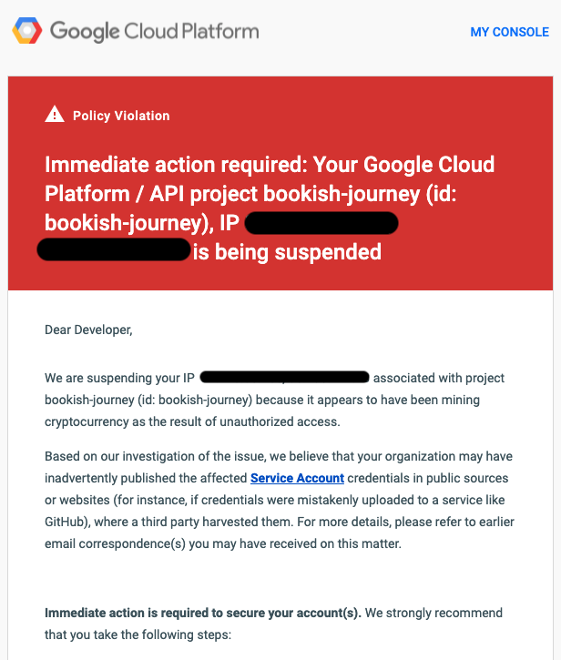
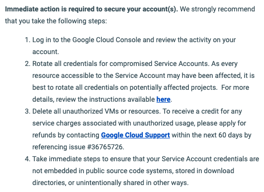

## What Happened

On sunday night after we uploaded our files to [our class repository on GitHub](https://github.com/AdrianTJ/bookish-journey), we noticed that there was a file that was not supposed to be there. The file was the authentication credentials for our Google Cloud Platform project, `bookish-journey-itam` and it was stored in our `src` folder. 

About an hour later, we got a very scary email from Google: 

## Initial Measures to Mitigate Problems

Before GCP even notified us with that email, we had noticed the credentials on our GitHub Repository. We decided to delete the file and commit, but, becasue at the end of the day git is a version control system, the file remained in the repository history. Because of that, we had to take more extreme measures, and ended up finding [the BFG Repo-Cleaner by rtyley](https://rtyley.github.io/bfg-repo-cleaner/), which is a great CLI tool that scrubs all references and changes to a certain file from git history. We did that, and thinking that the problem had been solved, disconnected from our meeting and continued with our night. About an hour later, the email arrived. 

## Deleting the Project

When we got the email, we were worried, and one of our team members couldn't even log on to google services for a little bit. That included Gmail, and the GCP. We got some instructions about what to do in the email: 

The problem is, we understood all of these steps, *but did not know how to perform them*. We are all relatively new to the GCP, and because of that, we were worried we would mess up the cleanup and end up worse than before. 

As such, the only viable approach that we saw was to delete the project. 

We followed the steps [detailed here](https://cloud.google.com/resource-manager/docs/creating-managing-projects#shutting_down_projects), and with that, we had deleted the project. We had no access to the files or querties inside of it anymore. 

## Post Mortem

The first thing we did after this was organize ourselves and get together for a brief meeting the following day to start a new project and get it up and running to where the previous one was. This didn't take as long as the first time as we had already gone through the process, and if anything, helped with solidifying concepts. 

We had a conversation with Jake and Adrian about what happened, and decided not to contact Google about the breach. We did not want to dispute the claim, because we had not been mining Cryptocurrency and the project was indeed breached. 

All in all, we lost some hours of work, and about two dollars worth of credits, which is thankfully not too much. Reading up some on the matter, it seems [it takes hackers 1 minute to find and abuse credentials exposed on GitHub](https://www.comparitech.com/blog/information-security/github-honeypot/), so, it makes sense that although we deleted the file quickly, we still had problems. 

The best thing we can recommend is reading up on [how to keep your Google Cloud service account keys safe](https://cloud.google.com/blog/products/identity-security/help-keep-your-google-cloud-service-account-keys-safe), which would have been a big help if we had read it before the breach. 
