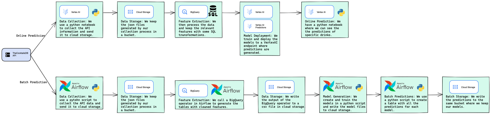
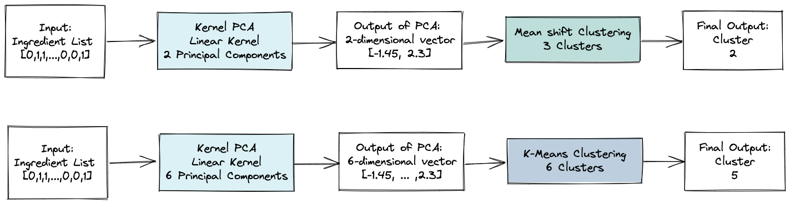

# Bookish Journey: Final Report

| Name                           | Email                  | CU     | Github Handler |
|:------------------------------:|:----------------------:|:------:|:--------------:|
| Adrian Tame                    | atamejac@itam.mx       | 142235 | AdrianTJ       |
| Joel Jaramillo Pacheco         | joel.jaramillo@itam.mx | 30615  | joelitam2021   |
| Mónica Altagracia García López | mgarc372@itam.mx       | 203145 | mogarcia62     |
| Juan Carlos Soto Hernández     | jsotoher@itam.mx       | 82616  | JSOHE          |

## Overview


## Problem Definition

The problem that we decided to tackle is, abstractly, to build a recommendation system for some sort of food or drink. After some research in the space, we ended up finding [TheCocktailDB](https://www.thecocktaildb.com/), an open [API](https://www.redhat.com/en/topics/api/what-are-application-programming-interfaces) that gave us access to a collected database of some drinks. Recommendation systems are a [very well studied area of Machine Learning](https://www.mdpi.com/2079-9292/11/1/141), generally relying on unsupervised learning techniques or reinforcement learning to achieve a coherent recommendation engine. For our specific problem we decided early on that we liked the idea of a multi-model system, where we leveraged the predictions of different types of models to generate the final recommendations. We ended up choosing two different clustering models to generate the predictions. [Clustering recommendation is well studied](https://towardsdatascience.com/building-a-food-recommendation-system-90788f78691a), so we decided that this task made sense and our goals were interesting and decided to continue with the project. 

## System Design



We use different technologies and parts of the GCP tech stack to build and deploy the recommendation engine: 

* **VertexAI**: Initially used for prototyping, it became a core component of the way we generate online predictions. We use the [Workbench](https://cloud.google.com/vertex-ai/docs/workbench/) to have JupyterLab up so we can run some of the scripts, and we also use [VertexAI models and endpoints to deploy the model](https://cloud.google.com/vertex-ai/docs/predictions/deploy-model-api) and then call it using the [predictions](https://cloud.google.com/vertex-ai/docs/predictions/online-predictions-custom-models) interface. 

* **Cloud Storage**: We keep everything relevant to the project on cloud storage. We took more of a [data lake](https://cloud.google.com/learn/what-is-a-data-lake#:~:text=A%20data%20lake%20is%20a,of%20it%2C%20ignoring%20size%20limits.) approach where we have two buckets where we store structured and sometimes unstructured data. 

* **BigQuery:** We use this part of the tech stack as our one-stop shop for everything having to do with SQL and data cleaning. We extract the data and save it in a JSON file for each cocktail, so we do some data manipulation to keep the features we want and clean the data up a little. In our [ELT](https://www.integrate.io/blog/what-is-etlt/) pipeline, BigQuery is one of the places where we transform the data, and we further process it and do feature design and extraction in Python. 

* **Airflow**: Our [orchestrator](https://www.element61.be/en/resource/airflow-data-ai-orchestration#:~:text=What%20is%20Airflow%3F,scheduling%2C%20orchestrating%20and%20monitoring%20workflows.) of choice. Batch predictions in our workflow require no interaction from people and the recommendation systems are run automatically. This requires some differences in the tech stack, particularly that we don't use VertexAI when running the airflow instance, but we generate and save the the models the same way. 

* **Python**: The glue that holds everything together, this is the language where we create models, call predictions, generate the tables of batch predictions and prototype. This project is a Python project that uses other components, but first and foremost, this is a Python (and GCP) project. 

An interesting question is why we basically have two stacks or workflows, and this is answered in the difference of the components and parts required to do the types of predictions that we want to do. For [online predictions](https://cloud.google.com/ai-platform/prediction/docs/online-vs-batch-prediction), the orchestration and generation of predictions makes little sense, as we need to be able to access the models with new information at any moment. One use case for online prediction is instead of grabbing a previous cocktail, we want to predict where a list of ingredients not in the database (a new cocktail) would fall and what cocktails we would recommend. If we want a prediction for a cocktail that already exists, then the problem is much simpler, and we can simply refer back to the table of results we had generated the previous day or week and see what cocktails are recommended by the clustrting models, which would be [batch prediction](https://cloud.google.com/ai-platform/prediction/docs/online-vs-batch-prediction). These differing approaches, needs, and goals can be seen in the structure and underlying systems that we use. 

## API Access and Feature Engineering

When we call [TheCocktailDB](https://www.thecocktaildb.com/) API, the output is a JSON object with the information that we requested. To be able to build a database from the API, we needed a way to access all the cocktails stored in the base, so we decided that the easiest way to do this was to use the alphabet method implemented in the API, as an example, 

```
www.thecocktaildb.com/api/json/v1/1/search.php?f=a
```

will return all cocktails that start with the letter `a`. We iterate through the database like this, and then store the resulting files in cloud storage. A sample response for a single cocktail looks like this: 

```json
{"drinks":[{"idDrink":"11007","strDrink":"Margarita","strDrinkAlternate":null,"strTags":"IBA,ContemporaryClassic","strVideo":null,"strCategory":"Ordinary Drink","strIBA":"Contemporary Classics","strAlcoholic":"Alcoholic","strGlass":"Cocktail glass","strInstructions":"Rub the rim of the glass with the lime slice to make the salt stick to it. Take care to moisten only the outer rim and sprinkle the salt on it. The salt should present to the lips of the imbiber and never mix into the cocktail. Shake the other ingredients with ice, then carefully pour into the glass.","strInstructionsES":null,"strInstructionsDE":"Reiben Sie den Rand des Glases mit der Limettenscheibe, damit das Salz daran haftet. Achten Sie darauf, dass nur der \u00e4u\u00dfere Rand angefeuchtet wird und streuen Sie das Salz darauf. Das Salz sollte sich auf den Lippen des Genie\u00dfers befinden und niemals in den Cocktail einmischen. Die anderen Zutaten mit Eis sch\u00fctteln und vorsichtig in das Glas geben.","strInstructionsFR":null,"strInstructionsIT":"Strofina il bordo del bicchiere con la fetta di lime per far aderire il sale.\r\nAvere cura di inumidire solo il bordo esterno e cospargere di sale.\r\nIl sale dovrebbe presentarsi alle labbra del bevitore e non mescolarsi mai al cocktail.\r\nShakerare gli altri ingredienti con ghiaccio, quindi versarli delicatamente nel bicchiere.","strInstructionsZH-HANS":null,"strInstructionsZH-HANT":null,"strDrinkThumb":"https:\/\/www.thecocktaildb.com\/images\/media\/drink\/5noda61589575158.jpg","strIngredient1":"Tequila","strIngredient2":"Triple sec","strIngredient3":"Lime juice","strIngredient4":"Salt","strIngredient5":null,"strIngredient6":null,"strIngredient7":null,"strIngredient8":null,"strIngredient9":null,"strIngredient10":null,"strIngredient11":null,"strIngredient12":null,"strIngredient13":null,"strIngredient14":null,"strIngredient15":null,"strMeasure1":"1 1\/2 oz ","strMeasure2":"1\/2 oz ","strMeasure3":"1 oz ","strMeasure4":null,"strMeasure5":null,"strMeasure6":null,"strMeasure7":null,"strMeasure8":null,"strMeasure9":null,"strMeasure10":null,"strMeasure11":null,"strMeasure12":null,"strMeasure13":null,"strMeasure14":null,"strMeasure15":null,"strImageSource":"https:\/\/commons.wikimedia.org\/wiki\/File:Klassiche_Margarita.jpg","strImageAttribution":"Cocktailmarler","strCreativeCommonsConfirmed":"Yes","dateModified":"2015-08-18 14:42:59"}]}
```

We then access this data in BigQuery, where we build a table that includes the names of the cocktails, their ID, and the ingredients that they contain. This is table is then loaded into our Jupyter Notebooks or Python scripts and we do feature engineering on it, the first thing we do is that we turn the cocktails into an occurance matrix for ingredients, `0` if it does not occur in the cocktail, `1` if it does. 

The problem with categorical variables such as an ingredients list is that we cannot use them directly for our clustering algorithms. We first need to pass them through a [Principal Component Analysis (PCA)](https://en.wikipedia.org/wiki/Principal_component_analysis#:~:text=Principal%20component%20analysis%20(PCA)%20is,components%20and%20ignoring%20the%20rest.) transformer to be able to use the generated features as our actual input for the clustering algorithms. 

## Machine Learning Component



The machine learning component starts in feature engineering, and after we hve gathered the ingredient list from the clean data. While we could have gone with another clustering algorithm that accepted categorical data (such as [K-Modes](https://www.analyticsvidhya.com/blog/2021/06/kmodes-clustering-algorithm-for-categorical-data/#:~:text=KModes%20clustering%20is%20one%20of,similar%20our%20data%20points%20are.)), we decided that because we wanted to use different types of clustering algorithms, we would instead transform the data to continous observations with PCA then apply the clustering algorithms. 

We decided on two different algorithms that we would be using for clustering: [K-Means](https://en.wikipedia.org/wiki/K-means_clustering) and [Mean-Shift](https://www.geeksforgeeks.org/ml-mean-shift-clustering/). While K-Means is a mean-seeking algorithm, Mean-Shift is a mode-seeking algorithm. This difference in the behaviour and way of generating the clusters alongside the fact that we include more principal components in the K-Means algorithm mean that we get different and varied results for the clusters, and therefore, the recommendations for each of the algorithms are going to be different from each other. This was by design, and in particular, we decided that we wanted toget much more precise recommendations from K-Means than from Mean-Shift, so as to generate variety in the recommendations we give the user. 

A problem for our application is that we have a hard time getting more information into the model. This will be detailed later in another section and post-mortem, but because of the size of the database (~430 observations), much of the prediction that we do is static, and that is a limitation in terms of the predictive power of the recommendations we would like to make. 

## System Evaluation

We have gone over some of the recommendations generated by both clustering algorithms and in the overall context of the database, they make sense. In terms of systems and the machine learning algorithms, everything works smoothly and the recommendations we make are adequate. One of the challenges we faced by choosing an unsupervised learning problem is that metrics are not as straightforwars, and by combining models, we didn't really have a good way to evaluate if the recommendations made sense other than looking at them directly. What follows is a small table of some of the results for the batch predictions, for context, which we believe are good recommendations for the cocktails mentioned. 

#### K-Means

| Cocktail        | Recom1                | Recom2        | Recom3        | Recom4                 | Recom5               |
| --------------- | --------------------- | ------------- | ------------- | ---------------------- | -------------------- |
| Old Fashoned    | Tomato Tang           | Sol Y Sombra  | Happy Skipper | Ice Pick               | Long vodka           |
| Long Island Tea | Ramos Gin Fizz        | Ice Pick      | Lemon Drop    | AT&T                   | Vermouth Cassis      |
| Negroni         | Bora Bora             | Midnight Mint | Afterglow     | Kill the cold Smoothie | Lassi Raita          |
| Whiskey Sour    | Pegu Club             | Apello        | Autodafé      | Texas Sling            | Kiwi Papaya Smoothie |
| Dry Martini     | English Rose Cocktail | Kool-Aid Shot | Loch Lomond   | Flaming Lamborghini    | Darkwood Sling       |

#### Mean-Shift

| Cocktail        | Recom1          | Recom2         | Recom3           | Recom4          | Recom5            |
| --------------- | --------------- | -------------- | ---------------- | --------------- | ----------------- |
| Old Fashoned    | Long Island Tea | Gin Daisy      | Zinger           | Turf Cocktail   | Addison           |
| Long Island Tea | Godchild        | Vodka Tonic    | Talos Coffee     | Ruby Tuesday    | Kool-Aid Shot     |
| Negroni         | Dirty Nipple    | Sea breeze     | Dirty Martini    | Barracuda       | Affinity          |
| Whiskey Sour    | Ice Pick        | Coke and Drops | Kentucky Colonel | Halloween Punch | Vesuvio           |
| Dry Martini     | AT&T            | Acapulco       | Sweet Sangria    | Vermouth Cassis | French Connection |

The areas of opportunity for our application really relate to the problem we wanted to solve and database being accessed. These were stark limitations in building a full fledged model. One of the things we considered as something we could do to help alleviate or soleve this was incorportate another API into our results, such as [the Edamam recipe database](https://developer.edamam.com/edamam-recipe-api), but the data cleaning and processing steps were heavy, and we didn't really know if we could even have a one to one relationship with the variables we ended up using from TheCoctailsDB API. We truly believe that the only way to make this application much more useful would be to ingest new data, and as such, if this project where to continue, that would probably be the first order of business in terms of making an application that is much more interesting. In short, we believe that we built the skepeton of something really great, but the system and data is just missing some meat on the bone. 

## Model Serving
