# :cocktail: :tropical_drink: :wine_glass: The Models :tumbler_glass: :bubble_tea: :cup_with_straw:

# File Directory

We include a brief rundown of the included files, along with how to use them, and how they all connect between each other. 

* **GCP_model_setup.sh:** Shell script that does a couple setup things so that modeling works. Initially, it calls another shell script, `GCP_variables.sh`, which includes all the relevant variables that we need to work with GCP. For obvious reasons, we do not upload this file. Then, it configures the project, setting it up with the correct project ID, and enables the APIs that we use to train and deploy the clustering models. Finally, the script creates a bucket where everything that we do in relation to clustering is stored. We note that since this bucket already exists, so most of the times this just returns an error, unless we delete it first. 

* **KMeans_Training.ipynb:** One of the two main notebooks in this folder. This notebook first calls the shell file `GCP_model_setup.sh`, and a YAML file called `GCP_model_details.yaml` , which we also do not incluse because it contains sensitive project information. We then do the modeling and Feature Engineering for K-Means in particular, and train the model. We test it by doing a recommendation in the same file, and then use the `joblib` package to save the model to the bucket we created in the `GCP_model_setup.sh` shell script, in a folder called `KMeans`. Finally, we send the model to Vertex AI using the script `GCP_Deploying_Kmeans.sh`. 

* **MeanShift_Model_Training.ipynb:** The same as `KMeans_Taining.ipynb`, but for the Mean Shift Clustering algorithm. We note that we use just 2 dimensions in PCA for this algorithm, as to make a more varied set of clusters. 

* **GCP_Deploying_KMeans.sh:** We use this script to do basically everything related to Vertex AI for model deployment. First, we upload the model to Vertex AI models. We then create an endpoint for KMeans, and using that endpoint, deploy the model to it. This allows us to access and predict using the model at the endpoint. We generally have it turned off, because this consumes machine resources and as such we are expected to pay for it. 

* **GCP_Deploying_MeanShift.sh:** The same as `GCP_Deploying_KMeans.sh`, but, this is used to deploy the Mean Shift clustering algorithm. 

* **Experiments.ipynb:** Jupyty notebook that includes some experiments with the deployed models. To run this notebook, the models have to bbe deployed to Vertex AI, and they need to be ready and receiving connections on an endpoint. Because only the clustering models are deployed to Vertex AI, then we do PCA on this file too, and then test some cocktails by sending a prediction request. We generate some recommendations from the same cluster for each of the two clustering algorithms we developed, and report those as the recommendations. 

## File Relation

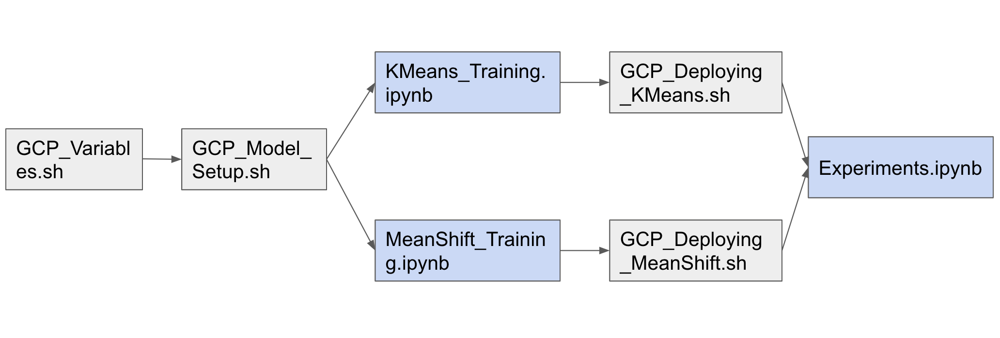

## 1. Data

We get the data from **TheCocktailDB** (https://www.thecocktaildb.com/), an open crowd-sourced database of drinks and cocktails from around the world. 

The dataset contains:

- *425* international drinks and cocktails recipes, 

- *296* unique ingredients, and

- *425* drink images.

## 2. Feature engineering

Data Preparation: This preprocessing step involves the manipulation and consolidation of raw data from different sources into a standardized format so that it can be used in a model:

For this process we had to:

- [x] Drop empty columns, there is no cocktail with more than 12 ingredients.

- [x] Selecting Specific Columns in Google BigQuery 

- [x] Change all ingredients to lowercase letters.

- [x] Standarize the name of ingredients

- [x] Pass ingredientes into one hot encoding format. 

We had to change the format of the data frames from this:

| idDrink | strIngredient1 | strIngredient2    | strIngredient3 | ... |
|:-------:|:--------------:|:-----------------:|:--------------:|:---:|
| 11001   | Vodka          | Light rum         | Gin            | ... |
| 11002   | Light rum      | Lime              | Sugar          | ... |
| 11003   | Bourbon        | Angostura bitters | Sugar          | ... |
| 11004   | Negroni        | Gin               | Campari        | ... |

To this:

| idDrink | Vodka | Lime | Bourbon | ... |
|:-------:|:-----:|:----:|:-------:|:---:|
| 11001   | 1     | 0    | 0       | ... |
| 11002   | 0     | 1    | 0       | ... |
| 11003   | 0     | 0    | 1       | ... |
| 11004   | 0     | 0    | 0       | ... |

We had to do this because, many machine learning algorithms cannot operate on label data directly. They require all input variables and output variables to be numeric.

One hot encoding is a process of converting categorical data variables so they can be provided to machine learning algorithms to improve predictions.

**One-hot encoded vector of Ingredients**

To find similarities between cocktails and their ingredients, we will represent a recipe by a one-hot encoded vector of its ingredients. We will be establishing a vocabulary of ingredients using a method ‘DictVectorizer’ provided in the sklearn library.We use [How Dishes are Clustered together based on the Ingredients?](https://medium.com/web-mining-is688-spring-2021/how-dishes-are-clustered-together-based-on-the-ingredients-3b357ac02b26) to guide our code.

> DictVectorizer transforms lists of feature-value mappings to vectors. This transformer turns lists of mappings (dict-like objects) of feature names to feature values into Numpy arrays for use with scikit-learn estimators.
> When feature values are strings, this transformer will do a binary one-hot (aka one-of-K) coding: one boolean-valued feature is constructed for each of the possible string values that the feature can take on.

```
#function to convert list of ingredients into a dictionary
def convert_to_dict(lst):
    d = {} #empty dict
    for ingre in lst:
        d[ingre] = 1
    return d
```

```
#We use the function to convert every row into a dictionary. 
#'vodka': 1, 'lime juice': 1... this will help us later to create a one hot encoding.

base['bagofwords'] = base.ingredients.str.split(',').apply(convert_to_dict)
print(base.bagofwords)
```

```
#DictVectorizer:  turns lists of mappings (dict-like objects) of feature names to feature values.C
#sparse, default=True. Whether transform should produce scipy.sparse matrices. In this case we set it as False.

vector_dict = DictVectorizer(sparse = False)

#fit_transform() is used on the training data so that we can scale the training data and also learn the scaling parameters of that data. 
#The fit method is calculating the mean and variance of each of the features present in our data. 
#The transform method is transforming all the features using the respective mean and variance.
#We past every dictionary into a list.

X = vector_dict.fit_transform(base["bagofwords"].tolist())

#We select the column strDrink(name of the drink) from de dataset
y = base.strDrink
```

## 3. Algorithm

## KPCA Method

Kernel Principal Component Analysis (KPCA) is a non-linear dimensionality reduction technique. It is an extension of Principal Component Analysis (PCA)   *which is a linear dimensionality reduction technique* using kernel methods.

PCA is a technique for reducing the number of dimensions in a dataset whilst retaining most information. It is using the correlation between some dimensions and tries to provide a minimum number of variables that keeps the maximum amount of variation or information about how the original data is distributed

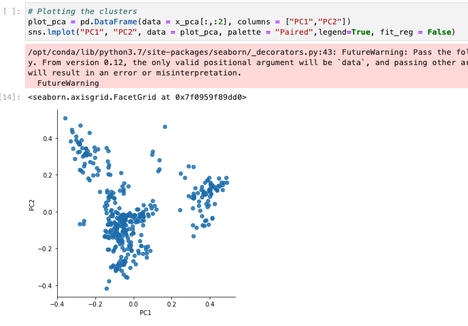

We are starting with somethig that is not a ML model at all, [cosine similarity](https://en.wikipedia.org/wiki/Cosine_similarity). This is in our opinion the easiest to implement, and can give us a good idea of some basic recommendations. 

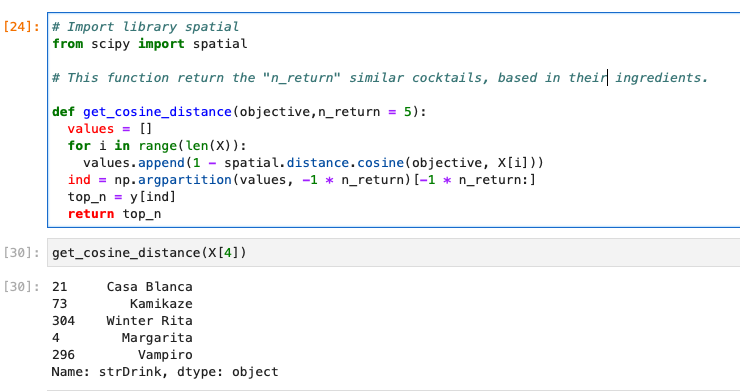

### K-means

We want to build a more robust ML system that will be based on clustering. We want to start with [k-means clustering](https://en.wikipedia.org/wiki/K-means_clustering), and grow to other clustering algorithms from there. This is where the meat of the machine learning computation will take place. Something interesting to note is that we have discrete classes and k-means clustering works **only on real vectors**, so we have to solve the problem of generating real vectors from a list of categorical variables. This will be done by using [principal component analysis (PCA)](https://en.wikipedia.org/wiki/Principal_component_analysis) as an in-between step from having the raw ingredients to generating an n-dimensional proximation to a point from that list. 

The K-means algorithm clusters data by trying to separate samples in n groups of equal variance, minimizing a criterion known as the inertia or within-cluster sum-of-squares. This algorithm requires the number of clusters to be specified. It scales well to large number of samples and has been used across a large range of application areas in many different fields.


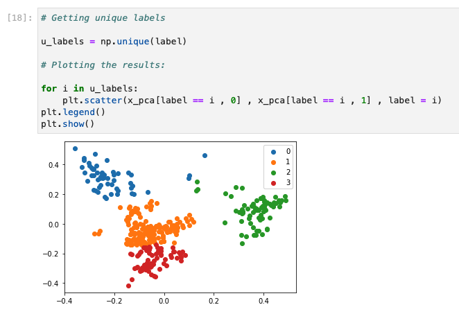

### Mean Shift Clustering

Unlike the popular K-Means cluster algorithm, mean-shift does not require specifying the number of clusters in advance. The number of clusters is determined by the algorithm with respect to the data.

Simply speaking, “mean shift” is equal to “shifting to the mean” in an iterative way. In the algorithm, every data point is shifting to the “regional mean” step by step and the location of the final destination of each point represents the cluster it belongs to. [Mean Shift](https://towardsdatascience.com/understanding-mean-shift-clustering-and-implementation-with-python-6d5809a2ac40)

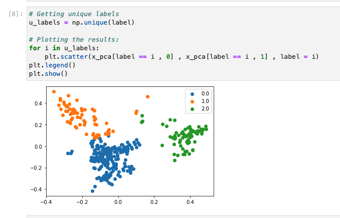

## 4. Experiments

### 4.1 Testing Mean Shift Clustering

We design 3 experiments with the **Mean Shift Clustering** model. But we will show the results of the  first experiment.


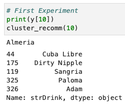


You can see that the first experiment, there are 5 cocktails:

 * Cuba Libre: Light rum, Lime, Coca-Cola	
 * Dirty Nipple: Kahlua, Sambuca, Baileys irish cream
 * Sangria: Red wine, Sugar, Orange juice, Lemon juice, Cloves, Cinnamon
 * Paloma: Grape Soda, Tequila
 * Adam: Dark rum, Lemon juice, Grenadine

They are sugar based or soda based.

So we also test the K-Means Clustering

### 4.2 Testing K-Means Clustering

Here we will show the experiment 2, with the **KMean Shift Clustering** model.


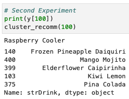


* Frozen Pineapple Daiquiri: Light rum	Pineapple	Lime juice	Sugar
* Mango Mojito: Lime, Mango	Mint, White Rum, Ice, Soda, Water,	Mango	
* Elderflower Caipirinha: Cachaca, Lime, Elderflower cordial
* Kiwi Lemon: Kiwi liqueur, Bitter lemon, Ice
* Pina Colada: Light rum, Coconut milk, Pineapple

You can see that they are citric based.

Finaly we show the third experiment.

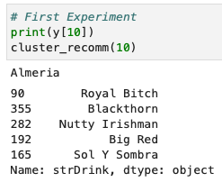

* Royal Bitch: Frangelico, Crown Royal
* Blackthorn: Sweet Vermouth, Sloe gin, Lemon peel
* Nutty Irishman: Baileys irish cream, Frangelico, Milk
* Big Red: Irish cream, Goldschlager
* Sol y sombra: Brandy,	Anisette

They are milk based.

## 5. ML metrics

We have decided that we are doing model evaluation for each of our two ML models, and then after combining these with the cosine distance and generating our final meta-model, we are also doing some more subjective evaluation based not on metrics but on human input.

For the ML model evaluation, we really have two different models. For clustering, we are sticking to silhouette curves and the elbow method also the. We note that both of these metrics are heuristic, which makes sense because we are working with an unsupervised learning problem. While there are other metrics to evaluate the efficiency and predictive power of the clusters we define, we are sticking with these two because we have worked with them in the past and we have a good understanding of how to interpret them.

The Elbow method helps to select the optimal number of clusters by fitting the model with a range of values for  𝐾. If the line chart resembles an arm, then the elbow (the point of inflection on the curve) is a good indication that the underlying model fits best at that point.

In the visualizer elbow is annotated with a dashed line, according to this method the best number of clusters is 6.

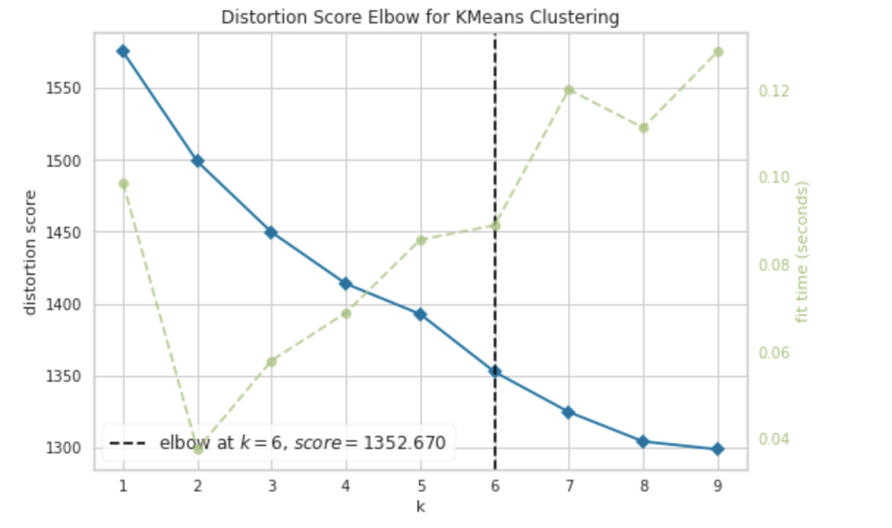

The **Silhouette Coefficient** is used when the ground-truth about the dataset is unknown and computes the density of clusters computed by the model. The score is computed by averaging the silhouette coefficient for each sample, computed as the difference between the average intra-cluster distance and the mean nearest-cluster distance for each sample, normalized by the maximum value. This produces a score between 1 and -1, where 1 is highly dense clusters and -1 is completely incorrect clustering.

The Silhouette Visualizer displays the silhouette coefficient for each sample on a per-cluster basis, visualizing which clusters are dense and which are not. This is particularly useful for determining cluster imbalance, or for selecting a value for 𝐾 by comparing multiple visualizers. 
In this case, the average Silhouette is around 0.05.

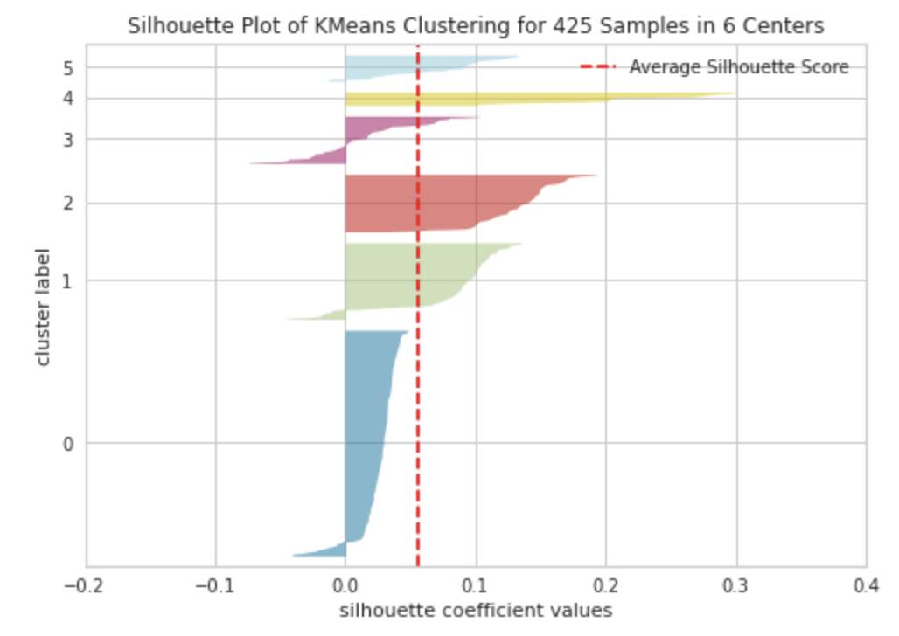


**Intercluster distance maps** display an embedding of the cluster centers in 2 dimensions with the distance to other centers preserved. E.g. the closer to centers are in the visualization, the closer they are in the original feature space. The clusters are sized according to a scoring metric. By default, they are sized by membership, e.g. the number of instances that belong to each center. This gives a sense of the relative importance of clusters.


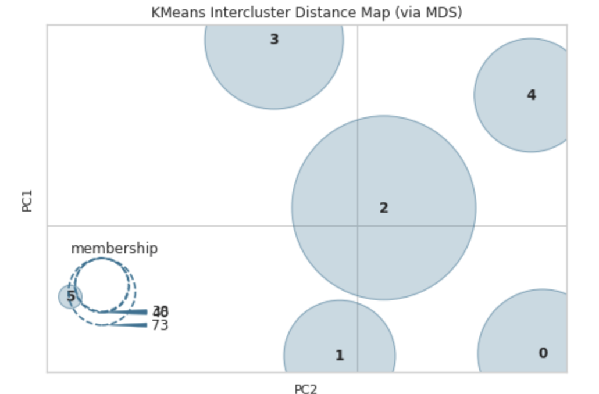

## 6. Trade-offs

* One trade-offs we made is select just the ingredients, dropping the cocktail preparation and pictures, so we are limited by this.

* Other trade-offs is selecting two models, KMean Shift Clustering and Mean Shift Clustering, leaving on a side other recommendation systems. 

## References

- https://plotly.com/python/pca-visualization/

- https://programminghistorian.org/en/lessons/clustering-with-scikit-learn-in-python

- https://medium.com/web-mining-is688-spring-2021/how-dishes-are-clustered-together-based-on-the-ingredients-3b357ac02b26

- https://scikit-learn.org/stable/modules/generated/sklearn.cluster.KMeans.html

- https://www.askpython.com/python/examples/plot-k-means-clusters-python

- https://numpy.org/doc/stable/reference/generated/numpy.argpartition.html
