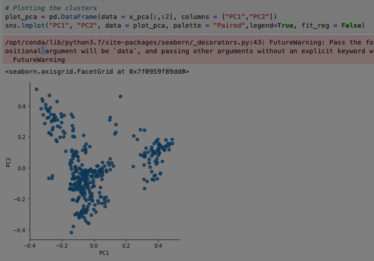
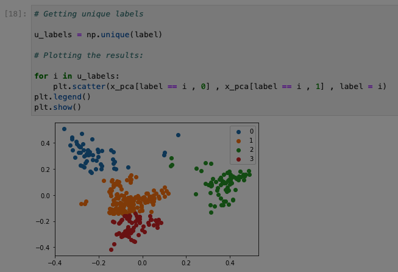

# Team 1. Bookish Journey: Cocktail Recipes Made By Machibe Learning

:cocktail: :tropical_drink: :wine_glass: :tumbler_glass: :bubble_tea: :cup_with_straw:

## 1. Data

We get the data from **TheCocktailDB** (https://www.thecocktaildb.com/), an open crowd-sourced database of drinks and cocktails from around the world. 

The dataset contains:

- *635* international drinks and cocktails recipes, 

- *296* unique ingredients, and

-  *635* drink images.

    
## 2. Feature engineering

Data Preparation: This preprocessing step involves the manipulation and consolidation of raw data from different sources into a standardized format so that it can be used in a model:

For this process we had to:

- [x] Drop empty columns, there is no cocktail with more than 12 ingredients.

- [x] Selecting Specific Columns in Google BigQuery 

- [x] Change all ingredients to lowercase letters.

- [x] Standarize the name of ingredients

- [x] Pass ingredientes into one hot encoding format. 

We had to change the format of the data frames from this:

|idDrink                          | strIngredient1                 | strIngredient2  | strIngredient3|...|
|:------------------------------:|:-----------------------:|:------:|:--------------:|:--------------:|
| 11001                    | Vodka       | Light rum         | Gin       |...|
| 11002                    | Light rum   | Lime	             | Sugar     |...|
| 11003                    | Bourbon     | Angostura bitters | Sugar     |...|
| 11004                    | Negroni     | Gin	             | Campari   |...|

	 
To this:

|idDrink                          | Vodka                 | Lime  | Bourbon |...|
|:------------------------------:|:-----------------------:|:------:|:--------------:|:--------------:|
| 11001                    | 1      | 0         | 0       |...|
| 11002                    | 0      | 1         | 0       |...|
| 11003                    | 0      | 0         | 1       |...|
| 11004                    | 0      | 0	        | 0       |...|

We had to do this because, many machine learning algorithms cannot operate on label data directly. They require all input variables and output variables to be numeric.

One hot encoding is a process of converting categorical data variables so they can be provided to machine learning algorithms to improve predictions.

**One-hot encoded vector of Ingredients**

To find similarities between cocktails and their ingredients, we will represent a recipe by a one-hot encoded vector of its ingredients. We will be establishing a vocabulary of ingredients using a method ‘DictVectorizer’ provided in the sklearn library.We use [How Dishes are Clustered together based on the Ingredients?](https://medium.com/web-mining-is688-spring-2021/how-dishes-are-clustered-together-based-on-the-ingredients-3b357ac02b26) to guide our code.

> DictVectorizer transforms lists of feature-value mappings to vectors. This transformer turns lists of mappings (dict-like objects) of feature names to feature values into Numpy arrays for use with scikit-learn estimators.
When feature values are strings, this transformer will do a binary one-hot (aka one-of-K) coding: one boolean-valued feature is constructed for each of the possible string values that the feature can take on.

'''
#function to convert list of ingredients into a dictionary
def convert_to_dict(lst):
    d = {} #empty dict
    for ingre in lst:
        d[ingre] = 1
    return d
'''

'''
#We use the function to convert every row into a dictionary. 
#'vodka': 1, 'lime juice': 1... this will help us later to create a one hot encoding.

base['bagofwords'] = base.ingredients.str.split(',').apply(convert_to_dict)
print(base.bagofwords)
'''

'''
#DictVectorizer:This transformer turns lists of mappings (dict-like objects) of feature names to feature values into Numpy arrays or scipy.sparse matrices for use with scikit-learn estimators.
#sparse, default=True. Whether transform should produce scipy.sparse matrices. In this case we set it as False.

vector_dict = DictVectorizer(sparse = False)

#fit_transform() is used on the training data so that we can scale the training data and also learn the scaling parameters of that data. 
#The fit method is calculating the mean and variance of each of the features present in our data. 
#The transform method is transforming all the features using the respective mean and variance.
#We past every dictionary into a list.

X = vector_dict.fit_transform(base["bagofwords"].tolist())

#We select the column strDrink(name of the drink) from de dataset
y = base.strDrink
'''
## 3. Algorithm 

## KPCA Method

Kernel Principal Component Analysis (KPCA) is a non-linear dimensionality reduction technique. It is an extension of Principal Component Analysis (PCA)   *which is a linear dimensionality reduction technique* using kernel methods.

PCA is a technique for reducing the number of dimensions in a dataset whilst retaining most information. It is using the correlation between some dimensions and tries to provide a minimum number of variables that keeps the maximum amount of variation or information about how the original data is distributed

### K-means

The K-eeans algorithm clusters data by trying to separate samples in n groups of equal variance, minimizing a criterion known as the inertia or within-cluster sum-of-squares. This algorithm requires the number of clusters to be specified. It scales well to large number of samples and has been used across a large range of application areas in many different fields.

    
## 4. Experiments
    
 ## 5. ML metrics
    
 ## 6. Trade-offs

## References

- https://plotly.com/python/pca-visualization/

- https://programminghistorian.org/en/lessons/clustering-with-scikit-learn-in-python

- https://medium.com/web-mining-is688-spring-2021/how-dishes-are-clustered-together-based-on-the-ingredients-3b357ac02b26

- https://scikit-learn.org/stable/modules/generated/sklearn.cluster.KMeans.html

- https://www.askpython.com/python/examples/plot-k-means-clusters-python

- https://numpy.org/doc/stable/reference/generated/numpy.argpartition.html
